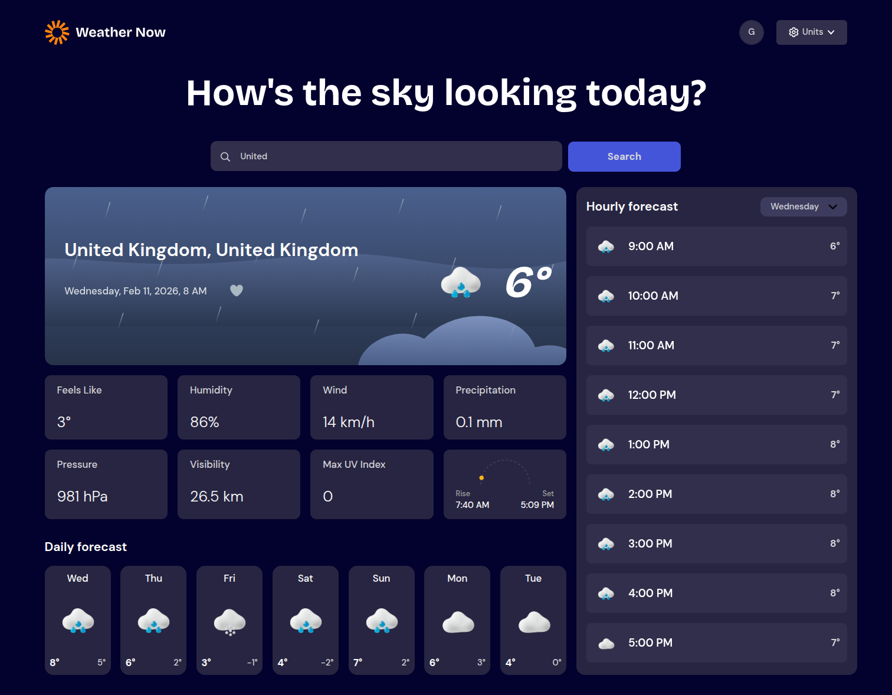
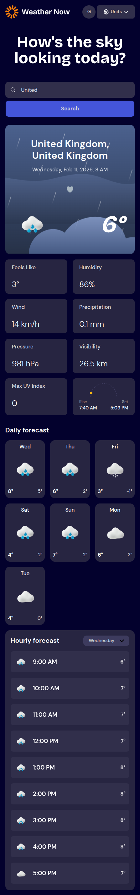

# Weather app solution

This is a solution to the [Weather app challenge on Frontend Mentor](https://www.frontendmentor.io/challenges/weather-app-K1FhddVm49).

## Table of contents

- [Overview](#overview)
    - [The challenge](#the-challenge)
    - [Screenshot](#screenshot)
    - [Links](#links)
- [My process](#my-process)
    - [Built with](#built-with)
- [Author](#author)

## Overview

### The challenge

Users should be able to:

- Search for weather information by entering a location in the search bar
- View current weather conditions including temperature, weather icon, and location details
- See additional weather metrics like "feels like" temperature, humidity percentage, wind speed, and precipitation amounts
- Browse a 7-day weather forecast with daily high/low temperatures and weather icons
- View an hourly forecast showing temperature changes throughout the day
- Switch between different days of the week using the day selector in the hourly forecast section
- Toggle between Imperial and Metric measurement units via the units dropdown
- Switch between specific temperature units (Celsius and Fahrenheit) and measurement units for wind speed (km/h and mph) and precipitation (millimeters) via the units dropdown
- View the optimal layout for the interface depending on their device's screen size
- See hover and focus states for all interactive elements on the page

Extra Features
- Add geolocation detection to automatically show weather for the user's current location on first visit
- Implement a favorites/saved locations system where users can bookmark frequently checked locations
- Include UV index, visibility, and air pressure data (available via Open-Meteo)
- Add sunrise/sunset times with visual indicators
- Add animated weather backgrounds that change based on current conditions
- Create dark/light mode themes that adapt to the time of day
- Add progressive web app (PWA) capabilities for mobile installation

### Screenshots

| Desktop View                                      | Mobile View                                    |
|---------------------------------------------------|------------------------------------------------|
|   |  |

### Links

- Solution URL: [GitHub](https://github.com/thyuhtooaung-dev/Weather_App)
- Live Site URL: [Vercel](https://weather-app-pi-eosin-28.vercel.app/)

## My process

### Built with

- [React](https://react.dev/)
- [Tailwind CSS](https://tailwindcss.com/)
- [TanStack Query (React Query)](https://tanstack.com/query/latest)
- [shadcn/ui](https://ui.shadcn.com/)
- [NestJS](https://nestjs.com/)
- [TypeORM](https://typeorm.io/)
- [Neon](https://neon.tech/)

## Author

- Github - [Thyu Htoo Aung](https://github.com/thyuhtooaung-dev)
- Frontend Mentor - [@PoungMont](https://www.frontendmentor.io/profile/thyuhtooaung-dev)
- X - [@PoungMont](https://x.com/Poung_Mont)