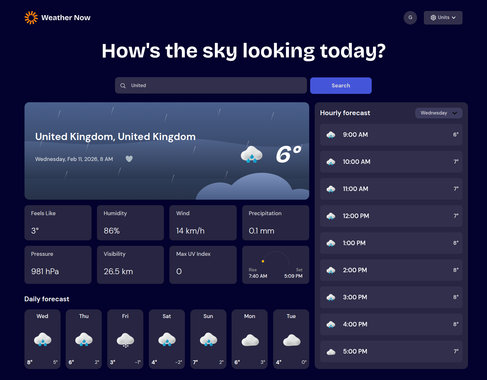
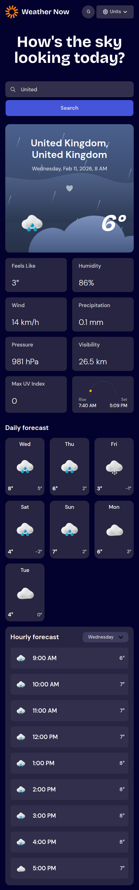

# Weather App

## Table of Contents
- [Features](#features)
- [Screenshots](#screenshots)
- [Links](#links)
- [My Process](#my-process)
    - [Built with](#built-with)
- [Author](#author)

## Features

### Weather Data & Visualization
* **Dynamic Search:** Search for real-time weather information by any global location.
* **Current Conditions:** Detailed overview including temperature, weather icons, and location metadata.
* **Comprehensive Metrics:** Track "Feels Like" temperatures, humidity, wind speed, and precipitation.
* **Detailed Forecasts:** * **7-Day Outlook:** High/low temperature trends with daily condition icons.
    * **Hourly Breakdown:** Granular temperature changes throughout the day.
    * **Day Selector:** Interactive toggle to switch hourly views between different days of the week.
* **Advanced Data:** Access to UV Index, visibility, and air pressure (powered by Open-Meteo).
* **Solar Tracking:** Visual indicators for sunrise and sunset times.

### Unit & Preference Control
* **Global Unit Toggles:** Seamlessly switch between **Imperial** and **Metric** systems.
* **Granular Customization:** Individual toggles for specific units ($^\circ\text{C}$ vs $^\circ\text{F}$, km/h vs mph, and millimeters for rainfall).
* **Smart Themes:** Dark and Light modes that automatically adapt based on the user's local time.
* **Dynamic Backgrounds:** Animated UI backgrounds that change to reflect current weather conditions.

### User Experience & Accessibility
* **Geolocation:** Automatic weather detection for the user's current location on initial load.
* **Saved Locations:** A favorites system to bookmark and quickly access frequently checked cities.
* **Responsive Design:** Fully optimized layout for mobile, tablet, and desktop screens.
* **Interactive UI:** High-visibility hover and focus states for all interactive elements.
* **PWA Ready:** Progressive Web App capabilities for installation on mobile devices.

## Screenshots

| Desktop View | Mobile View |
| :--- | :--- |
|  |  |

## Links

- Solution URL: [GitHub](https://github.com/thyuhtooaung-dev/Weather_App)
- Live Site URL: [Vercel](https://weather-app-pi-eosin-28.vercel.app/)

## My Process

### Built with
* [React](https://react.dev/)
* [Tailwind CSS](https://tailwindcss.com/)
* [TanStack Query](https://tanstack.com/query/latest)
* [shadcn/ui](https://ui.shadcn.com/)
* [NestJS](https://nestjs.com/)
* [TypeORM](https://typeorm.io/)
* [Neon](https://neon.tech/)

## Author
* Github - [Thyu Htoo Aung](https://github.com/thyuhtooaung-dev)
* Frontend Mentor - [@PoungMont](https://www.frontendmentor.io/profile/thyuhtooaung-dev)
* X - [@PoungMont](https://x.com/Poung_Mont)
